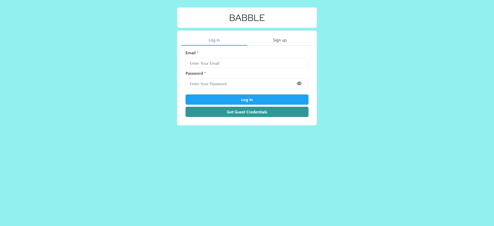
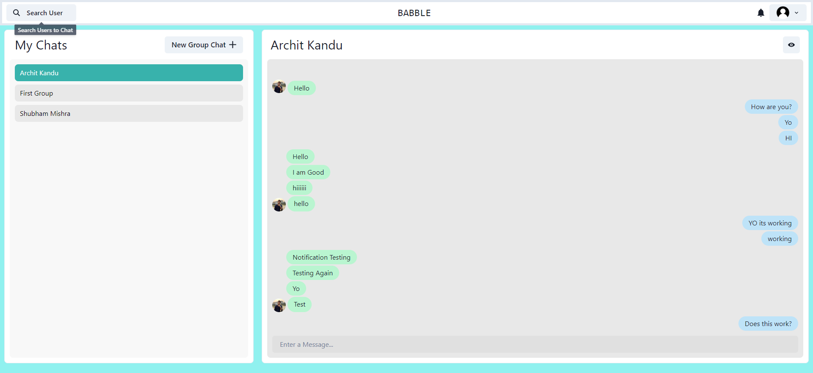
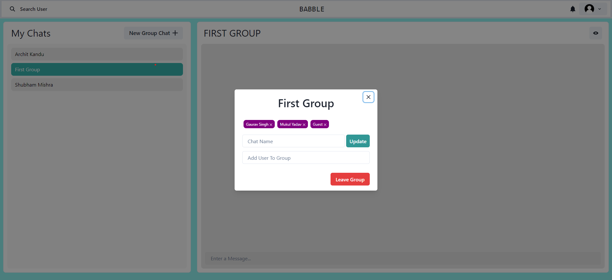
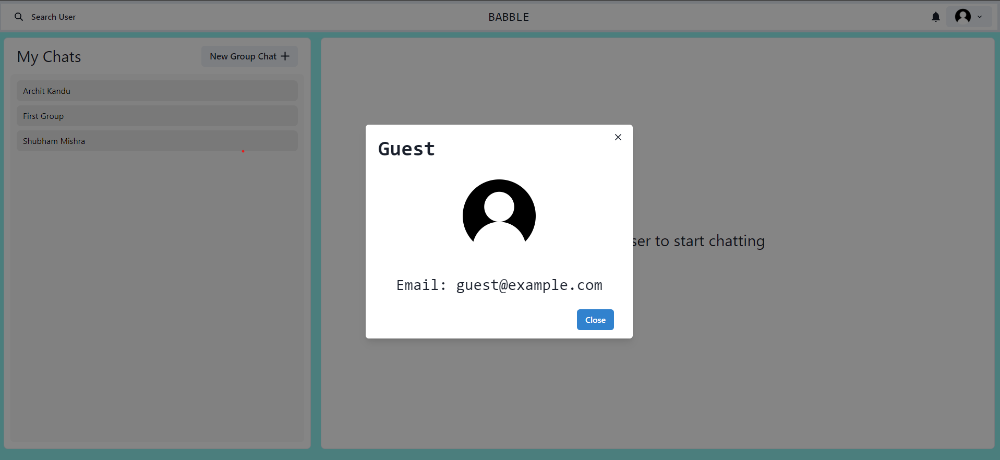

# Babble - MERN Stack Chat Application

Babble is a full-stack chat application built using the MERN (MongoDB, Express.js, React, Node.js) stack. It allows users to create accounts, join chat rooms, and engage in real-time conversations with other users. With features like user authentication, group chats, and more, Babble provides a seamless and interactive chatting experience.

## Table of Contents

- [Demo](#demo)
- [Features](#features)
- [Technologies](#technologies)
- [Installation](#installation)
- [Usage](#usage)
- [Contributing](#contributing)

## Demo

- Login/Signup Page:
  

- Single Chat:
  

- Group Chats:
  

- User Profile:
  

## Features

- User Registration and Authentication
- Create and Join Chat Rooms
- Real-time Chat with WebSocket Integration
- User Profiles with Avatars
- Emoji Support for Fun Conversations
- Search for Users and Chat Rooms
- Mobile Responsive Design
- ...and more!

## Technologies

- **Frontend**: React, Chakra UI, Socket.io-client
- **Backend**: Node.js, Express.js, Socket.io
- **Database**: MongoDB
- **Authentication**: JSON Web Tokens (JWT)
- **Cloud Storage**: Cloudinary (for avatars)

## Installation

1. Clone the repository:

   ```bash
   git clone https://github.com/ArchitKandu/Babble.git
   cd babble
   ```

2. Install the server dependencies:

   ```bash
   npm install
   ```

3. Set up environment variables:
   Create a ".env" file in the server directory and add the following variables:
   MONGO_URI: <i>YOUR MONGODB URI</i><br/>
   JWT_SECRET: <i>YOUR JWT_SECRET</i><br/>
   NODE_ENV: finished

4. Install the client dependencies:

   ```bash
   cd frontend
   npm install
   ```

5. Run the development server:

   - Server:
     ```bash
     cd Babble
     npm start
     ```
   - Client:
     ```bash
     cd frontend
     npm start
     ```

6. Open your browser and access the app at http://localhost:3000

## Usage

- Register an account or log in.
- Create a chat room or join an existing one.
- Start chatting in real-time with other users.
- Explore other features like user search, avatars, and more.

## Contributing

Contributions are welcome! If you'd like to contribute to this project, please follow these steps:

- Fork the project.
- Create a new branch for your feature or bug fix.
- Make your changes and ensure tests pass.
- Commit your changes.
- Push to your fork and submit a pull request.
